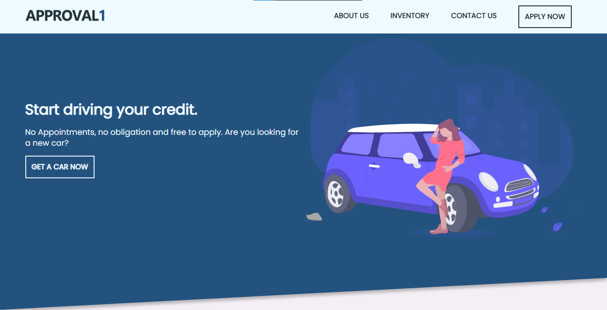
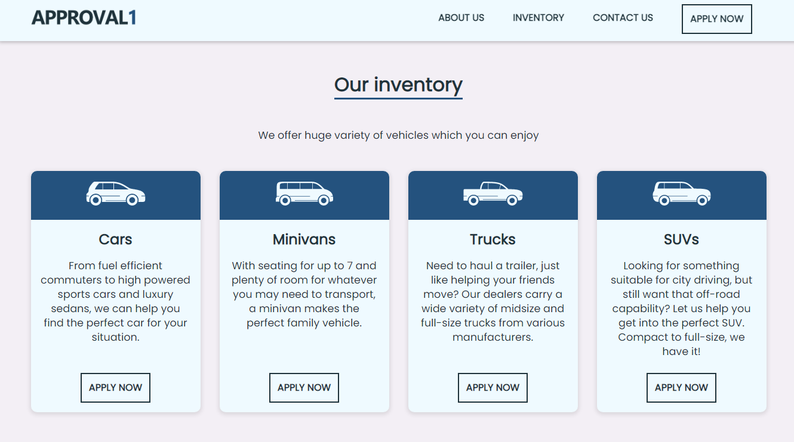
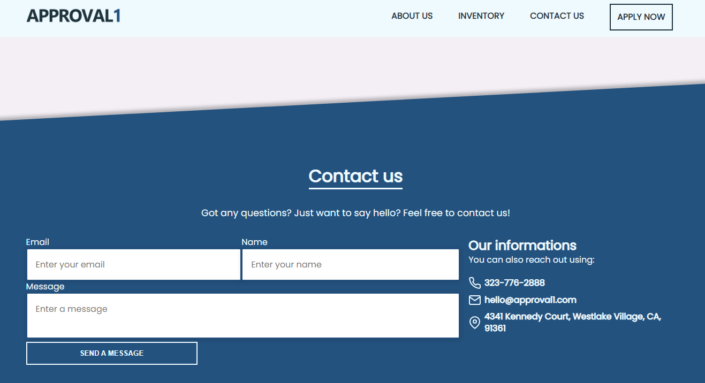

# PreMEST HTML Code Along

## Introduction

By following instructions contained here, you will build the HTML structure of the webpages pictured below





## Getting Started

1. Ensure you have Visual Studio Code with Live Server extension installed.

2. Your instructor will share the starter template with you

## Objectives

Using HTML only, you will implement

- the navigation bar
- the page banner
- the about section
- the inventory section
- the contact section
- footer for the webpage

### Building the navigation

In the `index.html` file of your project folder, locate `<h1>Approval 1</h1>` and delete it. Add the following instead

```html
<!-- navigation -->
<nav id="navbar">
  <div class="container navbar-inner">
    <!-- logo -->
    <div class="logo">
      <a href="#hero">
        
      </a>
    </div>

    <!-- navigation links -->
    <ul class="links">
      <li><a href="#about">About us</a></li>
      <li><a href="#inventory">Inventory</a></li>
      <li><a href="#contact">Contact us</a></li>
      <li>
        <a href="#" class="btn-apply-dark">Apply now</a>
      </li>
    </ul>

    <!-- menu icon -->
    <div class="hamburger" onclick="showMenu()">
      <i data-feather="menu"></i>
    </div>
  </div>
</nav>
```

### Page banner

```html
<!-- banner -->
<header id="hero">
  <div class="container hero-inner">
    <!-- leading text -->
    <div class="heading animated fadeIn">
      <h1>Start driving your credit.</h1>
      <p class="lead py-1">
        No Appointments, no obligation and free to apply. Are you looking for a
        new car?
      </p>
      <a href="#" class="btn-apply-light">Get a car now</a>
    </div>

    <!-- banner image -->
    <div class="car animated fadeIn">
      
    </div>
  </div>
</header>
```

### Creating About section

```html
<!-- main content -->
<main>
  <!-- about section -->
  <section id="about" class="py-2">
    <div class="container about-inner">
      <div class="centered py-3">
        <h1 class="title-dark">About us</h1>
      </div>

      <div class="about-grid">
        <p class="about-left lead">
          Founded in 2019 by Micheal, Approval1 has come a long way from its
          beginnings in California. When our team first started out, their
          passion for cars drove them to quit day job so that Approval1 can
          offer you the world's most best service. We now serve customers all
          over country, and are thrilled that we're able to turn our passion
          into our own website.
        </p>
        
      </div>
    </div>
  </section>

  <!-- division line -->
  <div id="hr">
    <hr class="container" />
  </div>
</main>
```

### Inventory Section

```html
<!-- inventory section -->
<section id="inventory" class="py-2">
  <div class="container inventory-inner">
    <div class="centered py-3">
      <h1 class="title-dark">Our inventory</h1>
    </div>

    <p class="lead centered">
      We offer huge variety of vehicles which you can enjoy
    </p>

    <div class="col-4 py-3">
      <div class="box">
        <div class="vehicle">
          
        </div>
        <div class="description">
          <h1>Cars</h1>
          <p class="lead">
            From fuel efficient commuters to high powered sports cars and luxury
            sedans, we can help you find the perfect car for your situation.
          </p>
          <a href="#" class="btn-apply-dark">Apply now</a>
        </div>
      </div>

      <div class="box">
        <div class="vehicle">
          
        </div>
        <div class="description">
          <h1>Minivans</h1>
          <p class="lead">
            With seating for up to 7 and plenty of room for whatever you may
            need to transport, a minivan makes the perfect family vehicle.
          </p>
          <a href="#" class="btn-apply-dark">Apply now</a>
        </div>
      </div>

      <div class="box">
        <div class="vehicle">
          
        </div>
        <div class="description">
          <h1>Trucks</h1>
          <p class="lead">
            Need to haul a trailer, just like helping your friends move? Our
            dealers carry a wide variety of midsize and full-size trucks from
            various manufacturers.
          </p>
          <a href="#" class="btn-apply-dark">Apply now</a>
        </div>
      </div>

      <div class="box">
        <div class="vehicle">
          
        </div>
        <div class="description">
          <h1>SUVs</h1>
          <p class="lead">
            Looking for something suitable for city driving, but still want that
            off-road capability? Let us help you get into the perfect SUV.
            Compact to full-size, we have it!
          </p>
          <a href="#" class="btn-apply-dark">Apply now</a>
        </div>
      </div>
    </div>
  </div>
</section>
```

### Contact Section

```html
<!-- contact section -->
<section id="contact">
  <div class="container contact-inner">
    <div class="centered py-2">
      <h1 class="title-light">Contact us</h1>
    </div>

    <p class="lead centered">
      Got any questions? Just want to say hello? Feel free to contact us!
    </p>

    <div class="col-2">
      <div class="col-left">
        <form method="POST" class="py-2">
          <div class="contact-email">
            <label for="email">Email</label>
            <input
              required
              type="email"
              name="email"
              id="email"
              class="email-input"
              placeholder="Enter your email"
            />
          </div>

          <div class="contact-name">
            <label for="name">Name</label>
            <input
              required
              type="text"
              name="name"
              id="name"
              class="name-input"
              placeholder="Enter your name"
            />
          </div>

          <div class="contact-text">
            <label for="message">Message</label>
            <textarea
              required
              name="message"
              id="message"
              class="message-input"
              placeholder="Enter a message"
            ></textarea>
          </div>

          <button type="submit" class="btn-apply-light">Send a message</button>
        </form>
      </div>

      <div class="col-right py-2">
        <h2>Our informations</h2>
        <p>You can also reach out using:</p>

        <ul class="contact-data py-1">
          <li>
            <p>
              <i data-feather="phone"></i>
              <span>
                <strong>323-776-2888</strong>
              </span>
            </p>
          </li>

          <li>
            <p>
              <i data-feather="mail"></i>
              <span>
                <strong>hello@approval1.com</strong>
              </span>
            </p>
          </li>

          <li>
            <p>
              <i data-feather="map-pin"></i>
              <span>
                <strong>4341 Kennedy Court, Westlake Village, CA, 91361</strong>
              </span>
            </p>
          </li>
        </ul>
      </div>
    </div>
  </div>
</section>
```

### Footer Section

```html
<!-- footer -->
<footer>
  <div class="container footer-inner">
    <div class="credits">
      <h3>&copy; 2021</h3>
    </div>
    <div class="logo">
      <a href="#hero" aria-label="Get back to the top of the page">
        
      </a>
    </div>
  </div>
</footer>
```
