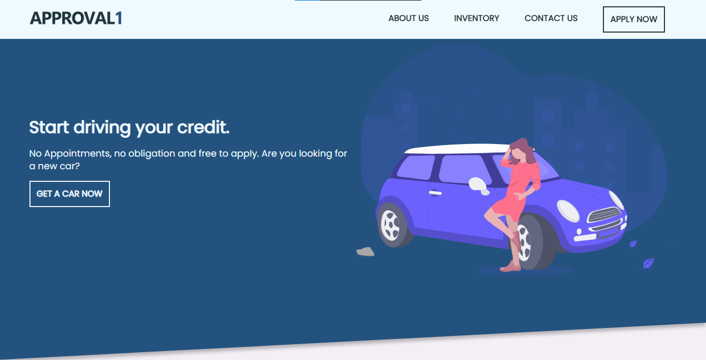
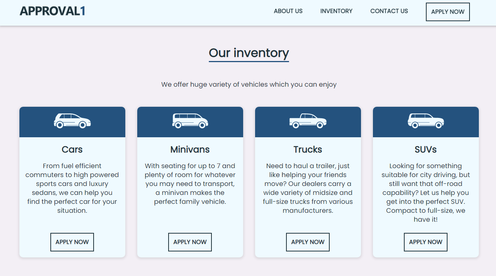
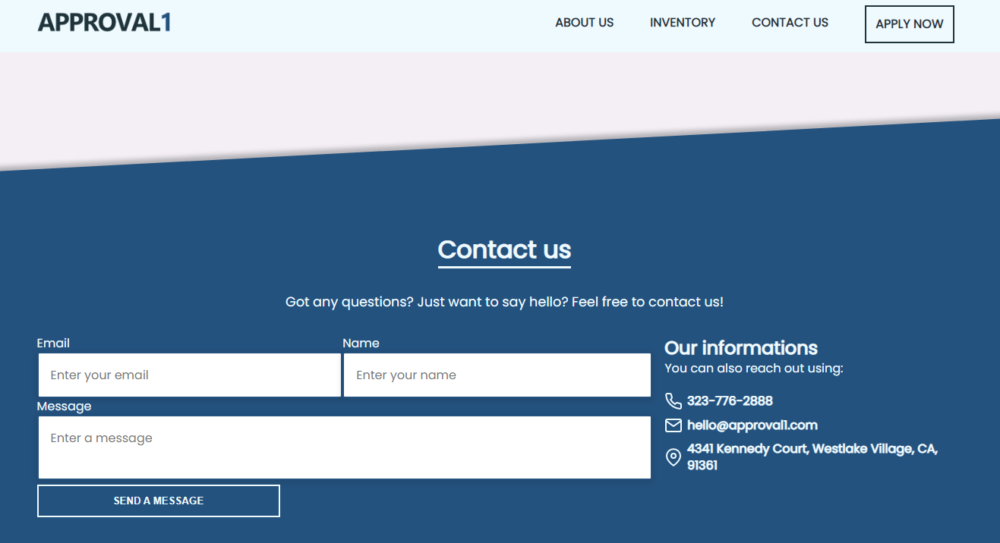

# PreMEST CSS Code Along

## Introduction

By following instructions contained here, you will apply CSS styles to the HTML structure you built and finally make it truly look as pictured below.





## Getting Started

1. Ensure you have completed the code along session for HTML

## Objectives

Using CSS only, you will apply styles to the following

- the navigation bar
- the page banner
- the about section
- the inventory section
- the contact section
- footer for the webpage

### Styling the navigation

Locate `main.css` file in the css folder of your project. Leave the import statement on `line 1` and add the following below it

```css
/* style rules for navigation */
.logo {
  display: flex;
  align-items: center;
  width: 175px;
  height: auto;
}

#navbar {
  height: auto;
  position: sticky;
  top: 0;
  z-index: 10;
  background: #effaff;
  box-shadow: none;
  transition: box-shadow 0.5s;
}

#navbar .navbar-inner {
  display: flex;
  justify-content: space-between;
}

#navbar .navbar-inner .hamburger {
  display: none;
}

#navbar .navbar-inner .links {
  display: flex;
}

#navbar .navbar-inner .links li {
  padding: 1.5rem 1.5rem;
}

#navbar .navbar-inner .links li:last-child {
  padding: 0.75rem 1.5rem;
}

#navbar .navbar-inner .links li a {
  font-weight: 800;
  text-decoration: none;
  color: #1f333b;
  text-transform: uppercase;
}
```

### Page banner

```css
/* style rules for banner section */
#hero {
  position: relative;
  background: #24527e;
  color: #effaff;
  height: 80vh;
  z-index: 1;
}

#hero::before {
  transform-origin: right bottom;
  box-shadow: 0 8px 6px -2px rgba(0, 0, 0, 0.25);
}

#hero .hero-inner {
  display: grid;
  grid-template-columns: repeat(2, 1fr);
  height: inherit;
  align-items: center;
}
```

### Creating About section

```css
/* style rules for about section */
#about {
  z-index: -1;
  background: #f3eff5;
  color: #1f333b;
  height: auto;
}
#about .about-inner .about-grid {
  display: grid;
  align-items: center;
  grid-template-columns: 2fr 1fr;
}
#about .about-inner .about-grid .about-left {
  padding-right: 2rem;
}
```

### Inventory Section

```css
/* style rules for inventory section */

#inventory {
  background: #f3eff5;
  color: #1f333b;
  height: auto;
  padding-bottom: 8rem;
}

#inventory .inventory-inner .col-4 {
  display: grid;
  grid-template-columns: repeat(4, 1fr);
  grid-gap: 2rem;
}

#inventory .inventory-inner .col-4 .box {
  color: #1f333b;
  background: #effaff;
  box-shadow: 0 2px 7px 2px rgba(0, 0, 0, 0.1);
  transition: transform 0.5s;
  border-radius: 10px;
  text-align: center;
  max-width: 25vw;
}

#inventory .inventory-inner .col-4 .box:hover {
  transform: scale(1.03);
}

#inventory .inventory-inner .col-4 .box .vehicle {
  background: #24527e;
  border-radius: 10px 10px 0 0;
  padding: 1rem;
}

#inventory .inventory-inner .col-4 .box .vehicle img {
  max-width: 100px;
  height: auto;
}

#inventory .inventory-inner .col-4 .box .description {
  display: grid;
  grid-template-rows: fit-content(4rem) 11rem 1fr;
  row-gap: 1rem;
  justify-items: center;
  padding: 1rem;
}
```

### Contact Section

```css
/* style rules for contact section */
#contact {
  background: #24527e;
  color: #effaff;
  height: 70vh;
  z-index: 1;
  position: relative;
  display: flex;
  flex-direction: column;
  justify-content: center;
}

#hero::before,
#contact::before {
  z-index: -1;
  content: "";
  width: 100%;
  height: 100%;
  position: absolute;
  background: inherit;
  transform: skewY(-3deg);
}

#contact::before {
  box-shadow: 0 -8px 6px -2px rgba(0, 0, 0, 0.25);
  transform-origin: top left;
}

#contact .contact-inner .col-2 .col-left form .contact-email .email-input,
#contact .contact-inner .col-2 .col-left form .contact-name .name-input,
#contact .contact-inner .col-2 .col-left form .contact-text .message-input {
  border-radius: 3px;
  box-shadow: 0 2px 7px 2px rgba(0, 0, 0, 0.1);
  padding: 1rem 1rem;
  font-size: inherit;
  font-family: inherit;
  width: 100%;
  transition: 0.5s;
  outline: none;
}

#contact .contact-inner .col-2 {
  display: grid;
  grid-template-columns: 2fr 1fr;
  grid-gap: 1rem;
}

#contact .contact-inner .col-2 .col-left form {
  display: grid;
  grid-template-areas:
    "email name"
    "message message";
  grid-gap: inherit;
}

#contact .contact-inner .col-2 .col-left form .contact-email {
  grid-area: email;
}
```

### Footer Section

```css
footer {
  height: auto;
  background: #effaff;
}
footer .footer-inner {
  display: flex;
  justify-content: space-between;
  align-items: center;
}
```

### Making the webpage responsive

1. In the css folder, create a file called `responsive.css`
2. In the `index.html` file, add this anywhere between the `header` tags

```html
<link rel="stylesheet" href="css/responsive.css" />
```

3. Back in the `responsive.css` file, add the following for responsive navbar

```css
/* responsive navbar for small and medium devices */
@media screen and (max-width: 800px) {
  #navbar .navbar-inner {
    flex-wrap: wrap;
  }
  #navbar .navbar-inner .hamburger {
    padding: 1.5rem 0;
    display: block;
  }
  #navbar .navbar-inner .hamburger .feather {
    width: 2.5rem;
    height: 2.5rem;
  }
  #navbar .navbar-inner .links {
    display: none;
  }
  #navbar .navbar-inner .responsive {
    flex-basis: 100%;
    display: flex;
    order: 2;
    flex-direction: column;
    text-align: center;
  }
  .page .page-container {
    width: 100vw;
  }
  #inventory .inventory-inner .col-4 {
    grid-template-columns: repeat(2, 1fr);
  }
  #inventory .inventory-inner .col-4 .box {
    max-width: 50vw;
  }
  #inventory .inventory-inner .col-4 .box .description {
    grid-template-rows: fit-content(4rem) 8.75rem 1fr;
    align-items: center;
  }
}

/* responsive height */
@media screen and (min-height: 868px) {
  #hero {
    height: 50vh;
  }
  #contact {
    height: 45vh;
  }
  .page .page-container {
    height: 50vh;
    width: 70vw;
  }
}
```

1. Page responsiveness for all screens

```css
/* desktops */
@media screen and (max-width: 1080px) {
  #inventory .inventory-inner .col-4 {
    grid-template-columns: repeat(2, 1fr);
  }
  #inventory .inventory-inner .col-4 .box {
    max-width: 50vw;
  }
  #inventory .inventory-inner .col-4 .box .description {
    grid-template-rows: fit-content(4rem) 6.25rem 1fr;
    align-items: center;
  }
}

/* large tablets and small laptops => 701 pixels up to 850 pixels */
@media screen and (max-width: 850px) {
  #contact {
    height: auto;
  }
  #contact .contact-inner .col-2 {
    grid-template-columns: 1fr;
  }
  #contact .contact-inner .col-2 .col-left form {
    grid-template-areas:
      "email"
      "name"
      "message";
  }
  #contact .contact-inner .col-2 .col-right {
    align-items: center;
  }
}

/* tablets and mobile devices => 700 pixels width and below */
@media screen and (max-width: 700px) {
  #hero {
    height: auto;
  }
  #hero .hero-inner {
    padding-top: 3rem;
    grid-template-columns: 1fr;
  }
  #hero .hero-inner .car {
    padding: 2rem 0;
  }
  #about .about-inner .about-grid {
    grid-template-columns: 1fr;
  }
  #about .about-inner .about-grid .about-left {
    padding-right: 0rem;
  }
  #inventory .inventory-inner .col-4 {
    grid-template-columns: 1fr;
  }
  #inventory .inventory-inner .col-4 .box {
    max-width: 100vw;
  }
  #inventory .inventory-inner .col-4 .box .description {
    grid-template-rows: fit-content(4rem) 1.5fr 1fr;
  }
}
```
