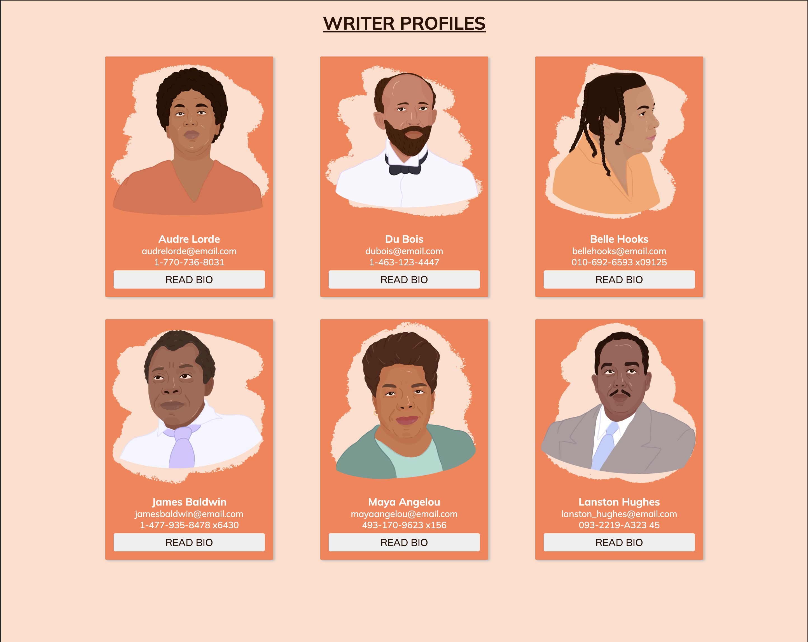

# PreMEST Code Along React (Components)

## Introduction

By following this guide, you will build a simple React App with data fetching and state management using a Class Component. The knowledge of Class Component state is essential for the upcoming tutorials. In addition, you'll see how to pass `props` to a Funtional Component

## Getting Started

1. Continue with the previous React App or create a new react app using `npx create-react-app profiles`
2. Make sure you have the following VS Code Extensions installed
   - ESLint
   - Prettier

## Objectives

- Gain knowledge of React Component state
- Use JavaScript ternary operator for conditional rendering
- Pass prop to component
- Use JavaScript fetch API

## Instructions

1. Create a folder in `src` called `components`. In the folder, create a file `ProfileCard.js`. Add the following

   ```jsx
   function ProfileCard({ writer }) {
     return (
       <div className="card">
         
         <div className="textGroup">
           <h3>{writer.name}</h3>
           <p>{writer.email}</p>
           <p>{writer.phone}</p>

           <button className="actionBtn"> Read Bio </button>
         </div>
       </div>
     );
   }

   export default ProfileCard;
   ```

2. In the `public` folder of your app, create a file `writers.json` and add the following

   ```json
   [
     {
       "id": 1,
       "name": "Audre Lorde",
       "avatar": "audre_lorde",
       "email": "audrelorde@email.com",
       "phone": "1-770-736-8031",
       "bio": "Commodo fugiat aliqua reprehenderit nostrud proident non proident ut velit Lorem Lorem officia. Sunt nostrud fugiat voluptate commodo do aliquip consequat. Laborum in nostrud laboris nostrud eiusmod. Fugiat ad laborum aliqua duis do eiusmod dolor fugiat esse nostrud deserunt."
     },
     {
       "id": 2,
       "name": "Du Bois",
       "avatar": "du_bois",
       "email": "dubois@email.com",
       "phone": "1-463-123-4447",
       "bio": "Aliqua fugiat amet est magna veniam eiusmod eu deserunt. Ex sit velit mollit excepteur. Deserunt sint nisi nisi incididunt nostrud incididunt cillum cillum proident nisi elit eu laborum duis. Quis aliquip laboris amet labore laboris officia labore sit exercitation duis cillum nostrud officia."
     },
     {
       "id": 3,
       "name": "Belle Hooks",
       "avatar": "belle_hooks",
       "email": "bellehooks@email.com",
       "phone": "010-692-6593 x09125",
       "bio": "Anim elit commodo amet velit officia voluptate veniam anim occaecat sint fugiat ex nostrud. Incididunt fugiat non sunt minim sunt velit tempor do enim aute reprehenderit mollit reprehenderit aliqua. Sunt exercitation culpa est qui sint ea laborum ipsum sunt nulla."
     },
     {
       "id": 4,
       "name": "James Baldwin",
       "avatar": "james_baldwin",
       "email": "jamesbaldwin@email.com",
       "phone": "1-477-935-8478 x6430",
       "bio": "Enim eu labore elit laboris voluptate amet mollit. Ex adipisicing ut dolor deserunt eu ex sint dolore sint consequat duis nisi nisi. Elit ad mollit quis ipsum  non non velit proident ea deserunt. Cillum culpa veniam nisi dolor Lorem eu anim labore quis in voluptate commodo dolor aute."
     },
     {
       "id": 5,
       "name": "Maya Angelou",
       "avatar": "maya_angelou",
       "email": "mayaangelou@email.com",
       "phone": "493-170-9623 x156",
       "bio": "Exercitation proident adipisicing enim ullamco esse officia veniam et proident in irure nulla. Anim irure aute amet nostrud sit non commodo. Nostrud elit sit consectetur dolore ipsum enim amet elit culpa nisi deserunt laborum incididunt. Occaecat aliqua magna excepteur exercitation aliquip et elit."
     },
     {
       "id": 6,
       "name": "Lanston Hughes",
       "avatar": "lanston_hughes",
       "email": "lanston_hughes@email.com",
       "phone": "093-2219-A323 45",
       "bio": "Sunt consequat id laboris dolor nisi deserunt voluptate ullamco cillum Lorem irure id. Fugiat tempor commodo reprehenderit pariatur velit aliqua. Nisi quis ea ea cupidatat non adipisicing. Officia officia est dolor eiusmod labore fugiat fugiat non ad aute nostrud ut."
     }
   ]
   ```

3. Copy the images folder of this directory and paste it in the public folder of your project

4. In `index.css` update with the following

   ```css
   * {
     margin: 0;
     padding: 0;
   }

   body {
     background-color: #ffdeca;
   }

   h1 {
     text-align: center;
     margin: 20px;
     color: #2c1203;
     text-transform: uppercase;
     text-decoration: underline;
   }

   .container {
     display: flex;
     flex-wrap: wrap;
     max-width: 80%;
     margin: auto;
   }

   .card {
     margin: 20px auto;
     min-width: 300px;
     background: coral;
     border-radius: 2px;
     box-shadow: 3px 2px 3px silver;
     transition: all 0.3s ease-in-out;
   }

   .card:hover {
     transform: scale(1.01);
     box-shadow: 5px 5px 10px whitesmoke;
   }

   .textGroup {
     padding: 10px 0;
     text-align: center;
     color: white;
   }

   .infoText {
     margin: 20px 0;
     font-size: 20px;
     font-weight: 700;
   }

   .action {
     margin-top: 50px;
     padding: 20px;
     display: flex;
     flex-direction: column;
     align-items: center;
     justify-content: space-between;
   }

   .actionBtn {
     width: 90%;
     margin: auto;
     color: #2c1203;
     font-size: 18px;
     padding: 5px 0;
     margin: 5px 0;
     text-transform: uppercase;
     outline: none;
     border: none;
     cursor: pointer;
     border-radius: 3px;
     transition: all 0.3s ease;
   }

   .actionBtn:hover {
     background-color: #ffdeca;
   }

   .actionBtn:active {
     transform: scale(0.987);
   }
   ```

5. Remove everything in `App.js` and add the following

   ```jsx
   import ProfileCard from "./components/ProfileCard";
   import { Component } from "react";

   class App extends Component {
     constructor() {
       super();

       // this makes it possible to use `handleClick` as a class method (function)
       this.handleClick = this.handleClick.bind(this);

       // how to set state in a class component
       this.state = {
         writers: {
           loading: false,
           list: []
         }
       };
     }

     // this method (function) is responsible for fetching and updating the  `writers` data in state
     handleClick() {
       // temporarily sets the value of loading to `true`
       // we use setState to update values of state in  class components
       // later you'll learn how to do it in functional components
       this.setState({
         writers: {
           loading: true
         }
       });

       // setTimeout is a built-in JavaScript function that waits for some seconds before calling a function
       // in this case, we are waiting for 3.5s
       setTimeout(async () => {
         // fetch is a JavaScript API for getting information over the internet
         let resp = await fetch("/writers.json");
         let result = await resp.json();

         this.setState({
           writers: {
             loading: false,
             list: result
           }
         });
       }, 3500);
     }

     render() {
       // we use a JavaScript feature called `destructuring` to get values from the state
       const {
         writers: { loading, list }
       } = this.state;

       if (loading) {
         return (
           <div>
             <h1> Writer Profiles </h1>
             <div className="container">
               <div className="card action">
                 <p className="infoText"> Loading... </p>
               </div>
             </div>
           </div>
         );
       }

       return (
         <div>
           <h1> Writer Profiles </h1>
           <div className="container">

              <!-- we use JavaScript ternary operator to conditionally render elements depending if the list is empty or not -->
             {list.length === 0 ? (
               <div className="card action">
                 <p className="infoText"> Oops... no writer profile found</p>
                 <button className="actionBtn" onClick={this.handleClick}>
                   Get Writers
                 </button>
               </div>
             ) : (
               list.map((writer) => (
                 <ProfileCard key={writer.id} writer={writer} />
               ))
             )}
           </div>
         </div>
       );
     }
   }

   export default App;
   ```

6. Your app should look like the image below
   
